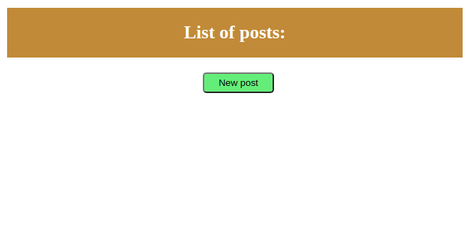
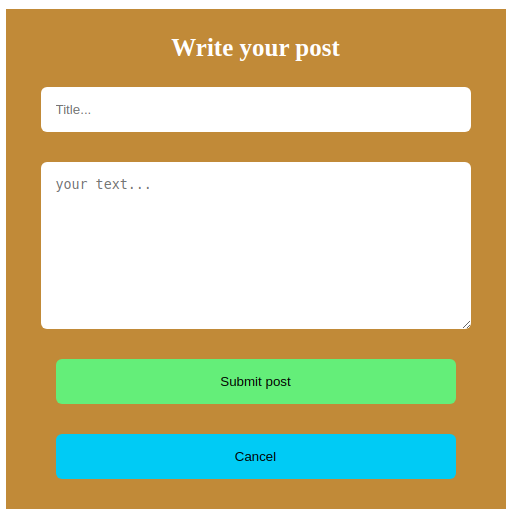
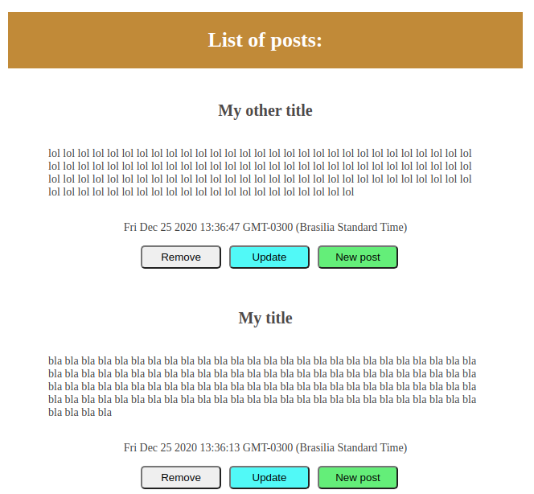
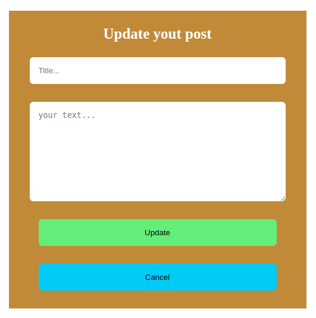

# Blog-Post

    - Basically a basic CRUD to purpose of learning the basic structure of web sites.
        - `Create post`
        - `List posts`
        - `Delete posts`
        - `Update posts`
    
    - The project don't have UI and UX because the unique focus in this project
      is a lerning principle basic of the web backend project
    
    - (UPDATE!) i was puted the project in structure (MVC).

# Tecnologies

    - Node js
    - MYSQL (database)
    - Handlebars (Template engine)
    - Express (framework)
    - Sequelize (connection Node to MYSQL)

# What i've learned?

    - The basic structures of web sites
    - Express basic
    - Connect with database with Sequelize
    - Requests http (methods: Get, Post...)
    - Integration with handlebars to connect variables with HTML
    - Basic of Model, View, Controller (MVC)

# What are the next steps?

    - Learn about API rest and create projects more professionals.
    - Learn NoSql (MongoDB) database
    - Struct MVC (Model view controller)
    - New tecniques of the express framework

# Do you want to test my project?
    - Before, install MYSQL (If you don't have)
    - git clone: https://github.com/henricker/Blog-Posting
    - yarn add -> To install all dependencies.
    - yarn dev -> To running my project.

## Presentation 

